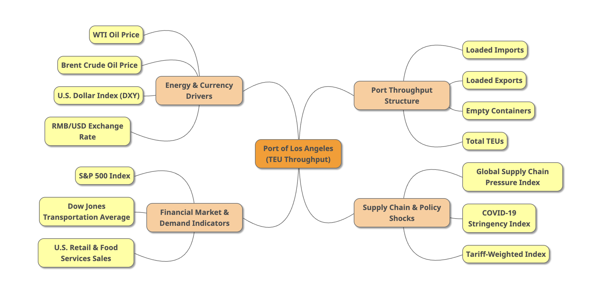
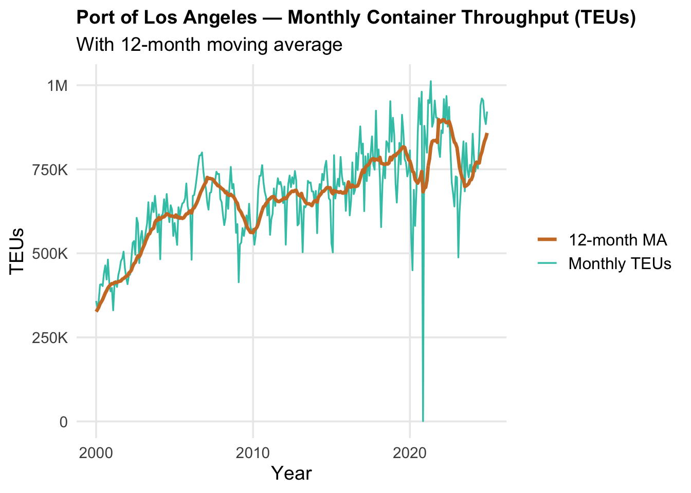
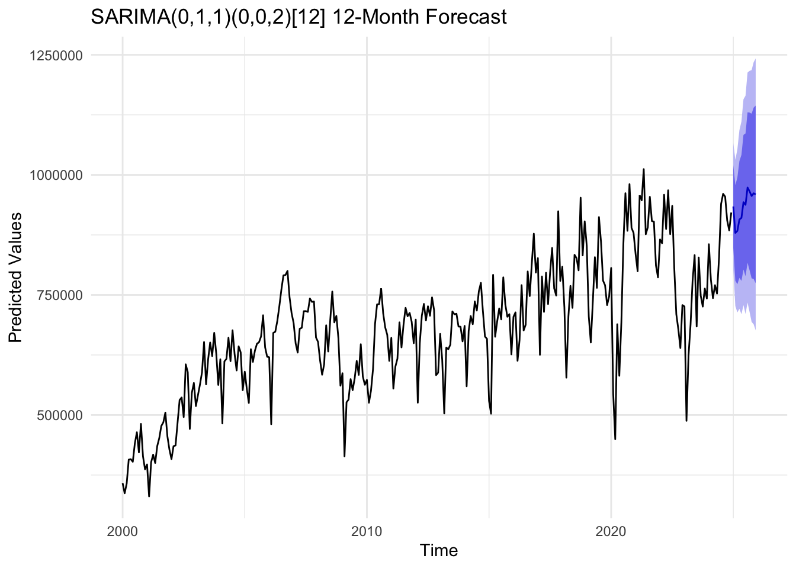
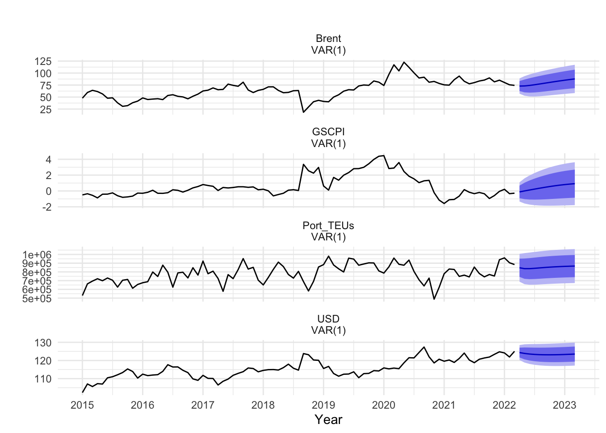
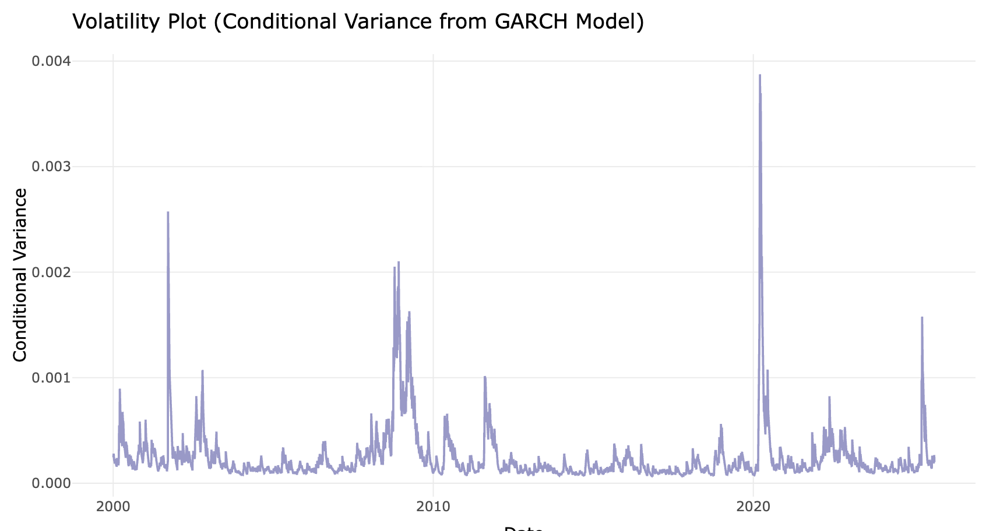
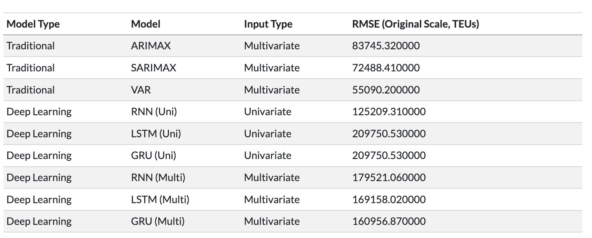
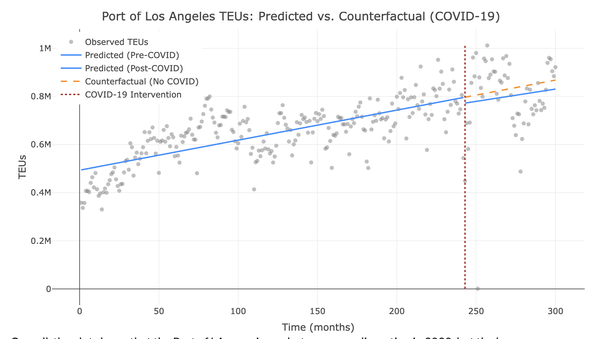

# 1. Trend & Motivation — Overall Trends and Research Motivation

This project aims to understand how container throughput at the Port of Los Angeles (Total TEUs) evolves over time and what economic forces drive its fluctuations. As one of the largest gateways for U.S. trade, TEUs reflect not only shipping activity but also broader shifts in supply-chain conditions, energy costs, and market demand. Our goal is not only to forecast future TEUs but also to identify the underlying trends and external events that shape the port’s behavior.

# 2. Univariate Models — Can TEUs Be Predicted by Historical Values Alone?

I began by testing whether future TEUs could be predicted using only their past values. The SARIMA model revealed two key characteristics: a strong and persistent 12-month seasonal cycle, and a mild long-term upward trend. While the model was able to capture these recurring patterns, its overall forecasting accuracy remained limited. This suggests that port throughput does not evolve in isolation—its movements are influenced by broader economic conditions, supply-chain pressures, and sudden external shock that univariate models cannot fully account for.

# 3. Multivariate Models — Understanding the Drivers Behind TEUs

After establishing the limitations of univariate forecasting, I expanded our analysis by incorporating key economic variables that interact with port activity. Using a VAR model with U.S. Dollar Index, Brent oil prices, and the Global Supply Chain Pressure Index (GSCPI), I achieved a substantial improvement in predictive accuracy. This specification produced the lowest RMSE (≈55,090), making it the best-performing model in the project.

The multivariate results highlight how closely port throughput is tied to broader economic conditions. Oil prices signal transportation and operating costs, the USD influences trade competitiveness, and GSCPI captures global supply-chain disruptions. Together, these variables help explain both the gradual evolution of TEUs and the sharp fluctuations observed during periods of economic stress. Unlike univariate models, the VAR framework successfully captured these dynamic linkages, offering a more realistic representation of how port activity responds to global economic forces.

# 4. Volatility Dynamics — Identifying Periods of Stress

To better understand the instability in port activity, I examined how the volatility of TEUs changes over time using a GARCH model. The results show clear clusters of elevated volatility during major global disruptions, including the 2008 financial crisis and the COVID-19 outbreak. These spikes are followed by slow and persistent declines, indicating that supply-chain stress tends to unfold gradually rather than dissipating quickly.

I also found that the volatility patterns were largely independent of the specific ARIMA structure used in the mean model, suggesting that GARCH captures the underlying shock dynamics robustly. This makes GARCH a suitable tool for identifying systemic risk periods in port operations.

# 5. Deep Learning Models — Mixed Performance with Limited Data

I also explored deep learning architectures to test whether non-linear patterns could improve forecasting accuracy. In the univariate setting, models such as RNN, LSTM, and GRU performed poorly, with RMSE values well above 120,000. The limited sample size and strong seasonal structure made it difficult for these models to learn stable patterns without overfitting.

When I incorporated additional variables—such as oil prices, the USD Index, and imports/exports—the performance improved modestly. The multivariate GRU achieved the best results among the neural networks, but still fell short of the VAR model by a wide margin. This experience reinforced an important lesson: more complex models do not guarantee better forecasts, especially when working with monthly macroeconomic data and relatively small samples.

# 6. Interrupted Time Series — Long-Term Shifts After COVID-19

To isolate the effect of major disruptions, I applied an Interrupted Time Series framework focusing on the COVID-19 period. The immediate drop in TEUs around early 2020 was not statistically significant, but the long-term trajectory changed meaningfully. After the intervention point, TEUs began rising at a noticeably faster rate, reflecting post-pandemic recovery, restocking cycles, and renewed demand. This suggests that structural changes matter more than short-term volatility when examining port throughput. By capturing both immediate and delayed effects, the ITS approach helped me understand how large-scale shocks reshape port activity over time.

# Final Summary
Overall, this project shows that the Port of Los Angeles’ container throughput is shaped by both steady economic trends and sudden global disruptions. By analyzing the series across several modeling frameworks, I found that different methods reveal different aspects of port behavior.

The univariate models established the strong seasonal pattern in TEUs but had limited predictive power, confirming that historical values alone cannot fully explain port activity. When I expanded to multivariate models, the results improved substantially. A simple VAR specification—using the USD Index, Brent oil prices, and the Global Supply Chain Pressure Index—produced the most accurate forecasts, outperforming more complex alternatives. This suggests that the key economic drivers of TEUs move in stable, linear ways that traditional models capture effectively.

The volatility analysis led to a similar conclusion. Although I experimented with different GARCH structures, the models consistently converged to a basic GARCH(1,1) form, indicating that a simple shock-persistence mechanism was sufficient. Adding ARIMA components to the mean equation offered little benefit, reinforcing that additional complexity does not always translate into better performance.

Deep learning models, particularly in the univariate setting, struggled with the small sample size and strong seasonality of the data, often producing overly smooth and less responsive forecasts. Multivariate neural networks improved somewhat but still trailed behind the VAR model. Finally, the interrupted time series analysis highlighted that the impact of COVID-19 was less about the immediate drop and more about a meaningful shift in the long-term trajectory of TEUs.

These findings emphasize a consistent message: effective modeling depends on understanding the structure and limitations of the data. For monthly port throughput, where relationships are stable and sample size is modest, classical models remain reliable, interpretable, and often superior. More advanced machine learning approaches may become useful with higher-frequency or richer datasets, but in this setting, simplicity proved to be a strength.

