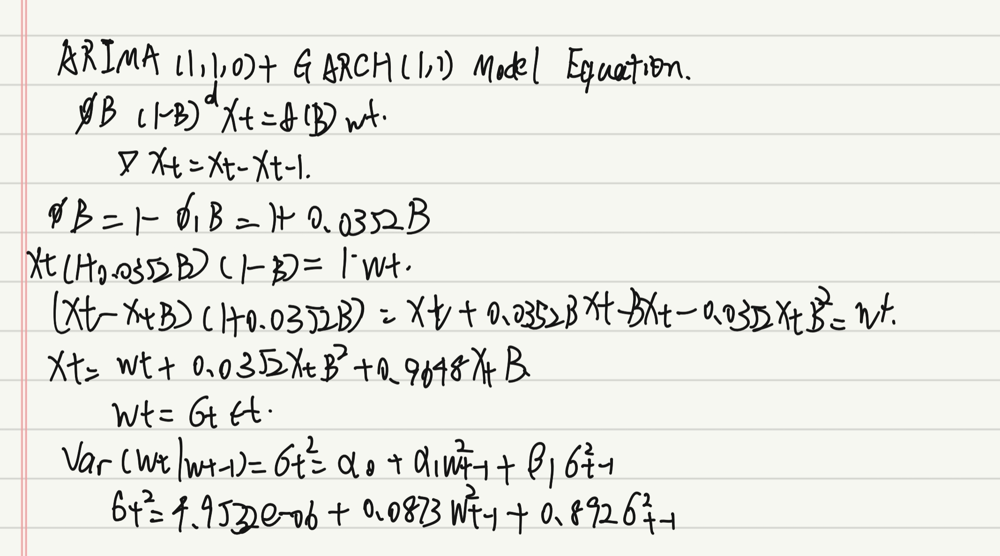

In the earlier sections, we examined trade patterns, external drivers, and supply-chain shocks affecting activity at the Port of Los Angeles. To extend this analysis from a financial perspective, we use the returns of the Dow Jones Transportation (DJT) to study volatility in the transportation sector.

Because DJT is closely linked to port activity and logistics conditions, its returns exhibit clear volatility clustering—periods of high turbulence tend to follow one another, as do calmer periods. To capture this behavior, we apply ARCH/GARCH models to examine how transportation-sector volatility responds to major events such as financial crises and the COVID-19 pandemic, offering additional insight into supply-chain-related risk.

# Time Series Plot
The Dow Jones Transportation is a market index that tracks major U.S. transportation and logistics companies, including airlines, railroads, trucking firms, and shipping carriers. Because it reflects investors’ expectations about freight demand, supply-chain conditions, and trade activity, the DJT behaves much like any financial asset whose price varies over time. Therefore, we treat the DJT as an asset price series and compute its returns to capture both its continuous growth rate and its time-varying volatility. This allows us to model how the transportation sector responds to economic shocks and supply-chain disruptions.

::: {.panel-tabset}
## Original DJT
```{r}
library(tidyverse)
library(ggplot2)
library(forecast)
library(astsa) 
library(xts)
library(tseries)
library(fpp2)
library(fma)
library(lubridate)
library(tidyverse)
library(TSstudio)
library(quantmod)
library(tidyquant)
library(plotly)
library(ggplot2)
library(knitr)
library(kableExtra)
library(fGarch)
library(dplyr)
library(dplyr)

# Get DJT data
invisible(getSymbols("^DJT", src = "yahoo",
                     from = "2000-01-01", to = "2025-08-30"))

# Build clean dataframe
djt <- data.frame(
  Date = index(DJT),
  Open = as.numeric(DJT[, "DJT.Open"]),
  High = as.numeric(DJT[, "DJT.High"]),
  Low  = as.numeric(DJT[, "DJT.Low"]),
  Close = as.numeric(DJT[, "DJT.Close"]),
  Adjusted = as.numeric(DJT[, "DJT.Adjusted"])
)

djt<- na.omit(djt)
djt$Date <- as.Date(djt$Date)

# Candlestick plot (fixed)
fig_djt <- plot_ly(
  data = djt,
  x = ~Date,
  type = "candlestick",
  open = ~Open,
  close = ~Close,
  high = ~High,
  low = ~Low
)

fig_djt <- fig_djt %>%
  layout(title = "Dow Jones Transportation Average (DJT) — Candlestick Plot")

fig_djt
```

## Log Price
```{r}
library(ggplot2)
library(plotly)
library(scales)

gg <- ggplot(djt, aes(x = Date, y = log(Adjusted))) +   
  geom_line(color = '#7faf7f') +
  scale_x_date(date_breaks = "5 years",
               date_labels = "%Y") +
  labs(x = "Year", title = "Log-transformed DJT")

ggplotly(gg)

```


## Daily Log Returns 
We transform prices into log returns for two main reasons:

- Stationarity
Prices are typically non-stationary, while returns are closer to stationary, making them suitable for ARIMA and ARCH/GARCH modeling.

- Volatility analysis
Log returns highlight volatility clustering, where periods of high turbulence tend to occur together, followed by calmer intervals.
```{r}
ret <- diff(log(djt$Adjusted))  
ret <- na.omit(ret)
# Plot log returns using autoplot
returns <- data.frame(
  Date = djt$Date[-1],   
  Return = ret
)

ggplot(returns, aes(x = Date, y = ret)) +
  geom_line(color = "#7faf7f") +
  labs(title = "Daily Log Returns of DJT",
       x = "Date",
       y = "Log Return") +
  theme_minimal()

```
From the plot, we observe sharp spikes during events such as the 2008 financial crisis and the 2020 COVID-19 pandemic, confirming the need for ARCH/GARCH models to capture the time-varying volatility.

:::

# ACF and PACF Plots
::: {.panel-tabset}
```{r}
ggtsdisplay(ret, main="ACF and PACF of Returns")
```
The returns show little autocorrelation, indicating that the mean process is largely unpredictable.

## Absolute Returns
```{r}
ggtsdisplay(abs(ret), main="ACF and PACF of Absolute Returns")
```
The absolute returns exhibit strong and persistent autocorrelation, showing clear volatility clustering.

## Squared Returns
```{r}
ggtsdisplay(ret^2, main="ACF and PACF of Squared Returns")
```
The squared returns display significant autocorrelation across many lags, confirming the presence of ARCH/GARCH effects.
:::

# ARIMA + GARCH Model
There are two common approaches to fitting a GARCH model to time series data. The first approach involves fitting an ARIMA model to the actual prices to capture the conditional mean dynamics. The residuals from the ARIMA model are then used to fit a GARCH model to model the time-varying volatility. The second approach is to apply the GARCH model directly to the returns series.

Here, we first choose ARIMA + GARCH Model.
## ARIMA on Log Prices

::: {.panel-tabset}
### Model Selection
```{r}
ggtsdisplay(log(djt$Adjusted), main="ACF and PACF of Log DJT")
```
The ACF plot of the log-transformed DJT shows significant autocorrelations at multiple lags. This gradual decay suggests that the log prices exhibit long-term dependencies, indicating differnecing is needed to make the series stationary.

```{r}
ggtsdisplay(diff(log(djt$Adjusted)), main="ACF and PACF of Differenced Log DJT")
```
I'll choose q & p for (0,4).

### Manual Search
```{r}
ARIMA.c = function(p1, p2, q1, q2, data) {
  d = 1
  i = 1
  temp = data.frame()
  ls = matrix(rep(NA, 6 * 1000), nrow = 1000)
  
  for (p in p1:p2) {
    for (q in q1:q2) {
          if (p + d + q <= 9) {
            
            model <- tryCatch({
              Arima(data, order = c(p, d, q), include.drift = TRUE)
            }, error = function(e) {
              return(NULL)
            })
            
            if (!is.null(model)) {
              ls[i, ] = c(p, d, q, model$aic, model$bic, model$aicc)
              i = i + 1
            }
          }
        }
      }
      temp = as.data.frame(ls)
      names(temp) = c("p", "d", "q", "AIC", "BIC", "AICc")
      temp = na.omit(temp)
      return(temp)
}

highlight_output = function(output, type="ARIMA") {
    highlight_row <- c(which.min(output$AIC), which.min(output$BIC), which.min(output$AICc))
    knitr::kable(output, align = 'c', caption = paste("Comparison of", type, "Models")) %>%
    kable_styling(full_width = FALSE, position = "center") %>%
    row_spec(highlight_row, bold = TRUE, background = "#FFFF99")  # Highlight row in yellow
}

output=ARIMA.c(p1=0,p2=4,q1=0,q2=4,data=log(djt$Adjusted))
highlight_output(output)
```

The manual search choose arima(0,1,0), arima(4,1,4) as the best model.

### Auto Search
```{r}
auto.arima(log(djt$Adjusted))
```
The auto search choose arima(1,1,0) as the best model

### Model Diagnostics
**ARIMA(0,1,0)**
```{r}
model_output_1 <- capture.output(sarima(log(djt$Adjusted), 0,1,0))
```
```{r}
start_line <- grep("Coefficients", model_output_1)  # Locate where coefficient details start
end_line <- length(model_output_1)  # Last line of output
cat(model_output_1[start_line:end_line], sep = "\n")
```

**ARIMA(4,1,4)**
```{r}
model_output_2 <- capture.output(sarima(log(djt$Adjusted), 4,1,4))
```

```{r}
start_line <- grep("Coefficients", model_output_2)  # Locate where coefficient details start
end_line <- length(model_output_2)  # Last line of output
cat(model_output_2[start_line:end_line], sep = "\n")
```
**ARIMA(1,1,0)**
```{r}
model_output_3 <- capture.output(sarima(log(djt$Adjusted), 1,1,0))
```
```{r}
start_line <- grep("Coefficients", model_output_3)  # Locate where coefficient details start
end_line <- length(model_output_3)  # Last line of output
cat(model_output_3[start_line:end_line], sep = "\n")
```
Among the three candidates, ARIMA(1,1,0) provides the cleanest residuals, significant parameters, and one of the lowest AIC values while maintaining a simple and interpretable structure. Therefore, ARIMA(1,1,0) is selected as the mean equation for subsequent GARCH volatility modeling.

### Model Fitting
**ARIMA(1,1,0)**
```{r}
# Fit ARIMA(1,1,0) model to the log-transformed stock prices
arima_110 <- Arima(log(djt$Adjusted), order = c(1,1,0))
summary(arima_110)
```
:::

## GARCH on Residuals
Fit a GARCH model to the residuals of the ARIMA model.

::: {.panel-tabset}
### Model Selection
To determine the appropriate values for GARCH(p, q), we examine the ACF and PACF plots of the squared residuals from the ARIMA model. Significant spikes in the ACF and PACF at certain lags can provide insight into the orders of p (ARCH terms) and q (GARCH terms) for the GARCH model. Specifically, the number of significant lags in the ACF and PACF can guide the selection of the GARCH model’s parameters.

```{r}
# Get residuals from the fitted ARIMA model
arima.res <- arima_110$residuals
# Compute squared residuals
squared.arima.res <- arima.res^2
ggtsdisplay(arima.res, main="ACF and PACF of ARIMA Residuals")
```
```{r}
ggtsdisplay(squared.arima.res, main="ACF and PACF of Squared ARIMA Residuals")
```
Significant spikes at lags 1–4 in the ACF of squared residuals suggest the presence of potential ARCH effects, indicating time-varying volatility in the data. Additionally, the PACF of squared residuals reveals structure at lags 1-3, further supporting the need for fitting an ARCH model to capture these dependencies.

### Manual Search
```{r}
# Initialize list to store models
models <- list()
cc <- 1

# Loop over GARCH(p, q) combinations
for (p in 1:3) {
  for (q in 1:4) {
    models[[cc]] <- garch(arima.res, order = c(q, p), trace = FALSE)
    cc <- cc + 1
  }
}

# Extract AIC values for all models
GARCH_AIC <- sapply(models, AIC)

# Find and return the best model (lowest AIC)
best_index <- which.min(GARCH_AIC)
models[[best_index]]
```
This suggests that the best model is GARCH(1,1), as it yields the lowest AIC, indicating a better fit to the data compared to other models.

### Model Fitting
```{r}
# Fit a GARCH(1,1) model to ARIMA residuals and display summary
garch_model <- garchFit(~ garch(1,1), data = arima.res, trace = FALSE)
summary(garch_model)
```
### Forecasting
```{r}
# Predict 100 steps ahead using the fitted GARCH(1,1) model
invisible(predict(garch_model, n.ahead = 100, plot = TRUE))
```
:::

## ARIMA(1,1,0)+GARCG(1,1) Model Equation
  

# GARCH Model
The second approach involves directly fitting a GARCH model to the returns, without fitt the ARIMA model. In this method, we inspect the ACF and PACF of the squared returns, rather than using ARIMA residuals, to determine the appropriate GARCH model.

```{r}
ggtsdisplay(ret^2, main="ACF and PACF of Squared Returns")
```

I'll choose q(1:4), p(1:4)

```{r}
# Initialize model storage
models <- list()
cc <- 1

# Grid search for GARCH(p, q), where p = ARCH order, q = GARCH order
for (p in 1:4) {
  for (q in 1:4) {
    models[[cc]] <- garch(ret, order = c(q, p), trace = FALSE)
    cc <- cc + 1
  }
}

# Extract AIC values
garch_aic <- sapply(models, AIC)

# Find best model (lowest AIC)
best_index <- which.min(GARCH_AIC)
models[[best_index]]
```
The GARCH(1,1) model is selected as the best model based on the lowest AIC value.

# Cross Validation
Next I'll compare Method 1: ARIMA(1,1,0) + GARCH(1,1) and Method 2: GARCH(1,1).

```{r}
log.b   <- log(djt$Adjusted)
returns <- diff(log.b)
n  <- length(log.b)

# 80% trian, 20% test
train_end <- floor(0.8 * n)
train <- log.b[1:train_end]
test  <- log.b[(train_end + 1):n]

# Model 1: ARIMA(1,1,0) + GARCH(1,1)
arima.fit <- Arima(train, order = c(1,1,0), include.drift = TRUE)
arima.res <- residuals(arima.fit)
fit1      <- garchFit(~ garch(1, 1), data = arima.res, trace = FALSE)

fc_arima  <- forecast(arima.fit, h = length(test))$mean
fc_garch1 <- predict(fit1, n.ahead = length(test))$meanForecast
pred1     <- fc_arima + fc_garch1

# Model 2: GARCH(1,1) on returns
ret_train <- diff(train)
fit2      <- garchFit(~ garch(1, 1), data = ret_train, trace = FALSE)
ret_fc2   <- predict(fit2, n.ahead = length(test))$meanForecast

pred2 <- numeric(length(test))
pred2[1] <- tail(train, 1) + ret_fc2[1]
for (i in 2:length(test)) {
  pred2[i] <- pred2[i-1] + ret_fc2[i]
}

RMSE1 <- sqrt(mean((pred1 - test)^2))
RMSE2 <- sqrt(mean((pred2 - test)^2))

tabel <- data.frame(
  Model = c("ARIMA(1,1,0)+GARCH(1,1)", "GARCH(1,1)"),
  RMSE = round(c(RMSE1, RMSE2), 4)
)
highlight_row <- which.min(tabel$RMSE)
kable(tabel, align = 'c', caption = "Model Comparison Based on RMSE") %>%
  kable_styling(full_width = FALSE, position = "center") %>%
  row_spec(highlight_row, bold = TRUE, background = "#FFFF99")
```

# Volatality Plot
```{r}
# Extract the conditional variances from GARCH
ht <- garch_model@h.t

# Create dataframe and plot
vol_df <- data.frame(Date = djt$Date, Volatility = ht)

p <- ggplot(vol_df, aes(x = Date, y = Volatility)) +
  geom_line(color = "#9999cc") +
  labs(
    title = "Volatility Plot (Conditional Variance from GARCH Model)",
    x = "Date",
    y = "Conditional Variance"
  ) +
  theme_minimal()

ggplotly(p)
```

This chart shows the conditional variance (volatility) of the Dow Jones Transportation Average (DJT), estimated using a GARCH model.

Since DJT reflects the performance of airlines, railroads, trucking, shipping, and delivery companies, its volatility reacts strongly to trade cycles, logistics disruptions, oil price shocks, and macroeconomic uncertainty.

Several distinct spikes correspond to well-known economic and global events:

- **2001–2002: Dot-com Bust & 9/11 Attacks**

The collapse of the tech bubble pushed the U.S. economy into recession, while the 9/11 attacks caused an unprecedented shutdown of air travel and cargo movement. DJT experienced a sharp jump in volatility as transportation activity dropped abruptly.

- **2008–2009: Global Financial Crisis**

The financial crisis caused a severe decline in global freight volumes. Transport companies faced collapsing demand, shipping disruptions, and extreme oil price swings.
DJT volatility surged to one of its highest levels in the entire period.

- **2010–2011: European Debt Crisis & Post-Crisis Supply Chain Stress**

The Eurozone debt crisis, slow U.S. recovery, and fragile global trade conditions created uncertainty for freight and logistics companies.
This period saw several medium-sized volatility spikes in DJT.

- **2014–2015: Oil Price Collapse & Trade Slowdown**

The dramatic fall in oil prices created mixed signals: Lower costs benefited airlines and trucking companies. But global trade weakened significantly. This tension resulted in elevated volatility in DJT during 2014–2015.


- **2020: COVID-19 Pandemic**

The pandemic produced historic disruptions: Air travel collapsed; Ports became congested; Supply chains broke down; Freight demand first crashed and then surged.
This led to the most extreme volatility peak in the entire series.

- **2021–2022: Supply Chain Crisis & Fed Tightening**

Post-pandemic recovery created record-high congestion in major ports and extreme freight volatility.
In 2022, aggressive Federal Reserve rate hikes increased recession fears, triggering another rise in DJT volatility.


