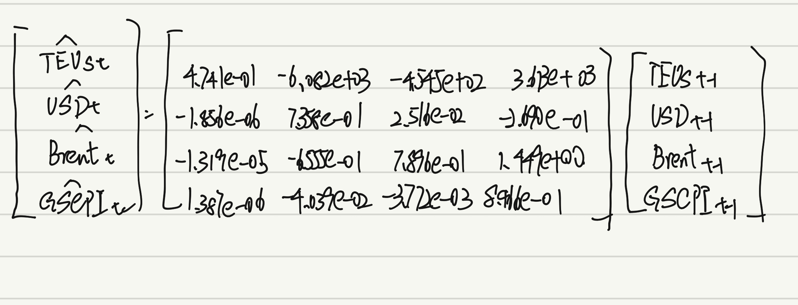
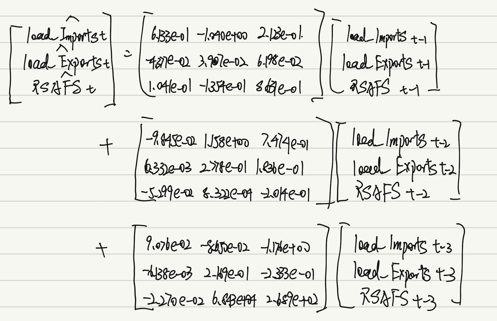
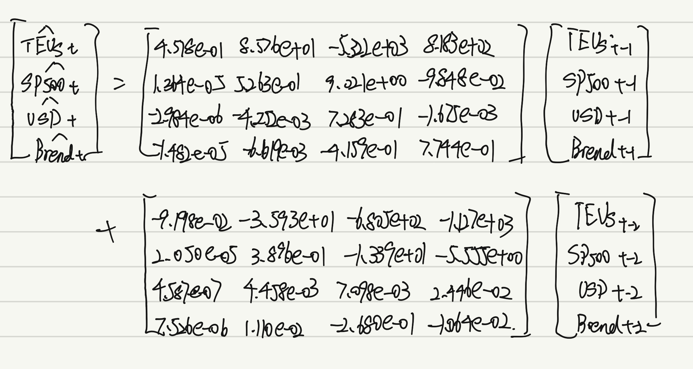
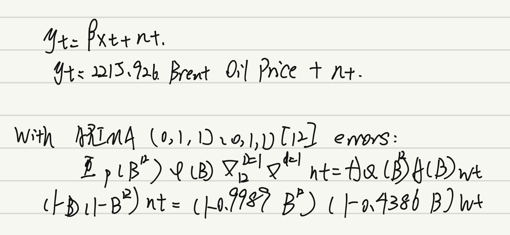

# Literature Review
A growing body of research has examined how macro-economic and policy factors shape global trade and port activity. Gopinath et al. (2020) propose the Dominant Currency Paradigm, showing that most international trade is invoiced in a few dominant currencies—primarily the U.S. dollar—which alters how exchange-rate changes affect export prices and trade volumes. Building on this, Cavallo, Gopinath, Neiman and Tang (2021) find that U.S. tariff increases were almost fully passed through to importers and consumers, while exchange-rate pass-through was comparatively limited. Benigno et al. (2022) introduce the Global Supply Chain Pressure Index (GSCPI) to quantify worldwide logistics and manufacturing bottlenecks, linking supply-chain stress to trade and inflation. Complementing these macro findings, earlier port-economy studies show a strong correlation between port throughput and national economic activity, suggesting that container flows can serve as a leading indicator of overall demand. Together, these studies provide both theoretical and empirical justification for including variables such as exchange rates, tariffs, and supply-chain pressures in models explaining port throughput dynamics.

**Reference**

- Gopinath, G., Boz, E., Casas, C., Díez, F. J., Gourinchas, P. O., & Plagborg-Møller, M. (2020).  
  [*Dominant Currency Paradigm.* American Economic Review, 110(3), 677–719.](https://www.aeaweb.org/articles?id=10.1257/aer.20171201)

- Cavallo, A., Gopinath, G., Neiman, B., & Tang, J. (2021).  
  [*Tariff Pass-Through at the Border and at the Store: Evidence from U.S. Trade Policy.* American Economic Review: Insights, 3(1), 19–34.](https://www.aeaweb.org/articles?id=10.1257/aeri.20190536)

- Benigno, G., Di Giovanni, J., Groen, J., & Nakamura, E. (2022).  
  [*The GSCPI: A New Barometer of Global Supply Chain Pressures.* Federal Reserve Bank of New York Economic Policy Review, 28(1), 1–19.](https://ssrn.com/abstract=4114973)

- Sanchez, R. J., & Wilmsmeier, G. (2021).  
  [*Modelling the Link Between Port Throughput and Economic Activity.* Maritime Economics & Logistics, 23(2), 245–263.](https://www.academia.edu/51400460/Modelling_the_link_between_port_throughput_and_economic_activity)


# Multivariate Analysis

Based on the data and previous univariate analysis, we will begin conducting multivariate analysis in this section.

Our data science questions focus on the Port of Los Angeles container throughput (TEU) and its interactions with global and domestic economic factors. Specifically, we aim to answer the following questions:

- What macroeconomic and policy variables interact with the Port of Los Angeles throughput?

- Which exogenous variables significantly affect port activity and cargo flows?

- How does port throughput respond to changes in global supply chain pressure, oil prices, tariffs, and the U.S. dollar index?

- What factors indicate or are influenced by fluctuations in port throughput?

## Dependent (main response): la_teu_ts

## Interacting Variables: Port Throughput and Global Trade Activity
### Port Throughput ↔ Global Demand:

Higher consumer demand in the U.S. stimulates imports through the Port of Los Angeles, reflected in higher Loaded Imports (la_li_ts). Similarly, global demand for U.S. goods drives Loaded Exports (la_le_ts). Both jointly determine overall Total TEUs (la_teu_ts), which serve as a proxy for international trade intensity.

### Trade Volume ↔ Financial Markets:
Port throughput interacts closely with financial market performance (sp500_ts). Rising equity markets usually signal economic expansion and stronger consumption, leading to greater import volume. Conversely, downturns in stock indices reflect weaker demand and may coincide with lower throughput.

### Trade Volume ↔ Supply Chain Pressure:
The Global Supply Chain Pressure Index (gscpi_ts) captures logistical bottlenecks and transportation delays. Elevated supply chain pressure can restrict cargo movement, increasing costs and reducing throughput efficiency, while easing pressures indicate recovery in trade flow.

### Policy & Trade Environment:
Tariff rates (ahs_ts) and global policy conditions influence trade incentives. Heightened tariffs can discourage imports and shift sourcing patterns, thereby reducing TEU counts, whereas tariff reductions promote smoother trade flows through major U.S. ports.

## Exogenous Variables: External Macroeconomic Drivers of Port Throughput
### Energy Costs (brent_ts):
The Brent Crude Oil Price affects shipping costs directly. Higher fuel prices increase freight rates, discourage long-distance trade, and may reduce port throughput. Conversely, lower oil prices reduce transport costs, stimulating cargo movement.

### Currency Value (usd_ts):
The U.S. Dollar Index influences international price competitiveness. A stronger dollar makes U.S. exports more expensive abroad and imports cheaper domestically, potentially widening the trade deficit and lowering export TEUs. Dollar depreciation, on the other hand, supports export growth.

### Domestic Consumption (rsafs_ts):
The U.S. Retail & Food Services Sales series reflects internal demand. Rising sales indicate stronger consumption and inventory restocking, which increase imports of consumer goods through the Port of Los Angeles.

### Global Supply Chain Conditions (gscpi_ts):
As an exogenous global logistics indicator, higher GSCPI values represent stress in transportation networks—typically due to pandemic disruptions, port congestion, or container shortages—which constrain throughput regardless of demand conditions.

### Trade Policy (ahs_ts):
Average tariff rates serve as an exogenous policy shock variable. Tariff hikes (e.g., Section 301 tariffs) reduce trade flow, while tariff reductions or exemptions promote recovery in container traffic.

```{r}
library(tidyverse)
library(ggplot2)
library(forecast)
library(astsa) 
library(xts)
library(zoo)
library(tseries)
library(fpp2)
library(fma)
library(lubridate)
library(tidyverse)
library(TSstudio)
library(quantmod)
library(tidyquant)
library(plotly)
library(readr)
library(dplyr)
library(kableExtra)
library(knitr)
library(patchwork)
library(vars)

# load data
raw <- read.csv("data-raw/la_teu_data.csv", stringsAsFactors = FALSE)

num_cols <- c("Loaded_Imports","Empty_Imports","Total_Imports",
              "Loaded_Exports","Empty_Exports","Total_Exports","Total_TEUs")

Sys.setlocale("LC_TIME", "C")

la_teu <- raw %>%
  mutate(
    Date = my(Date),
    across(all_of(num_cols), ~ as.numeric(gsub(",", "", .))),
    Prior_Year_Change = suppressWarnings(as.numeric(sub("%","", Prior_Year_Change))) / 100,
    Empty_Containers = Empty_Imports + Empty_Exports,
    Total_calc = Loaded_Imports + Loaded_Exports + Empty_Containers,
    Total_TEUs = ifelse(is.na(Total_TEUs), Total_calc, Total_TEUs)
  ) %>%
  arrange(Date) %>%
  filter(Date >= as.Date("2000-01-01"))

brent <- read_csv("data-raw/brent.csv", show_col_types = FALSE)
usd   <- read_csv("data-raw/usd.csv", show_col_types = FALSE)

brent <- brent %>%
  rename(Date = observation_date, Price = MCOILBRENTEU)
usd <- usd %>%
  rename(Date = observation_date, Index = DTWEXBGS)
usd <- usd %>%
  mutate(Date = as.Date(Date)) %>%
  arrange(Date) %>%
  tidyr::fill(Index, .direction = "down") 

gscpi <- read_csv(
  "data-raw/GSCPI.csv",
  col_types = cols(
    Date  = col_date(format = "%d-%b-%Y"),  # 31-Jan-1998
    GSCPI = col_double()
  ),
  show_col_types = FALSE
) %>%
  mutate(Date = floor_date(Date, "month")) %>%  
  filter(Date >= as.Date("2000-01-01"))

ahs_y <- read_csv("data-raw/ahs.csv", show_col_types = FALSE) %>%
  rename(
    Year = Date,
    Tariff = `AHS Weighted Average (%)`
  ) %>%
  filter(Year >= 2000, Year <= 2022)

library(dplyr)
library(readr)
library(lubridate)

sp500 <- read_csv("data-raw/sp500.csv", show_col_types = FALSE) %>%
  mutate(Date = as.Date(observation_date)) %>%
  filter(Date >= as.Date("2015-10-01"), Date <= as.Date("2024-12-01")) %>%
  mutate(YearMonth = floor_date(Date, "month")) %>%
  group_by(YearMonth) %>%
  arrange(Date, .by_group = TRUE) %>%
  slice_max(Date, with_ties = FALSE) %>%
  ungroup() %>%
  dplyr::select(YearMonth, SP500)

sp500_clean <- sp500 %>%
  filter(!is.na(SP500))


rsafs<- read_csv("data-raw/RSAFS.csv")
rsafs <- rsafs %>%
  mutate(Date = as.Date(observation_date)) %>%
  dplyr::select(Date, RSAFS)

la_teu_ts <- ts(la_teu$Total_TEUs, start = c(2000, 1), frequency = 12)
la_li_ts <- ts(la_teu$Loaded_Imports, start = c(2000, 1), frequency = 12)
la_le_ts <- ts(la_teu$Loaded_Exports, start = c(2000, 1), frequency = 12)
brent_ts <- ts(brent$Price, start = c(2000, 1), frequency = 12)
usd_ts <- ts(usd$Index, start = c(2000, 1), frequency = 12)
gscpi_ts <- ts(gscpi$GSCPI, start = c(2000, 1), frequency = 12)
ahs_ts <- ts(ahs_y$Tariff, start = min(ahs_y$Year), frequency = 1)
sp500_ts <- ts(sp500_clean$SP500, start = c(2000, 1), frequency = 12)
rsafs_ts <- ts(rsafs$RSAFS, start = c(2000, 1), frequency = 12)
```

```{r}
# ARIMA funtion
# first differencing
ARIMA.c = function(p1, p2, q1, q2, data) {
  d = 1
  i = 1
  temp = data.frame()
  ls = matrix(rep(NA, 6 * 100), nrow = 100)
  
  for (p in p1:p2) {
    for (q in q1:q2) {
          if (p + d + q <= 9) {
            
            model <- tryCatch({
              Arima(data, order = c(p, d, q), include.drift = TRUE)
            }, error = function(e) {
              return(NULL)
            })
            
            if (!is.null(model)) {
              ls[i, ] = c(p, d, q, model$aic, model$bic, model$aicc)
              i = i + 1
            }
          }
        }
      }
      temp = as.data.frame(ls)
      names(temp) = c("p", "d", "q", "AIC", "BIC", "AICc")
      temp = na.omit(temp)
      return(temp)
}

# second differencing
ARIMA2.c <- function(p1, p2, q1, q2, data) {
  d <- 2; i <- 1
  ncomb <- (p2 - p1 + 1) * (q2 - q1 + 1)
  ls <- matrix(NA_real_, nrow = ncomb, ncol = 6)

  for (p in p1:p2) for (q in q1:q2) {
    if (p + d + q <= 9) {
      model <- tryCatch(
        forecast::Arima(data, order = c(p, d, q), include.drift = TRUE),
        error = function(e) NULL
      )
      if (!is.null(model)) {
        ls[i, ] <- c(p, d, q, model$aic, model$bic, model$aicc)
        i <- i + 1
      }
    }
  }

  temp <- as.data.frame(ls[seq_len(i-1), , drop = FALSE])
  names(temp) <- c("p","d","q","AIC","BIC","AICc")
  na.omit(temp)
}

# SARIMA function
SARIMA.c = function(p1, p2, q1, q2, P1, P2, Q1, Q2, s, data) {
  d = 1
  D = 1
  i = 1
  temp = data.frame()
  ls = matrix(rep(NA, 9 * 100), nrow = 100)
  
  for (p in p1:p2) {
    for (q in q1:q2) {
      for (P in P1:P2) {
        for (Q in Q1:Q2) {
          if (p + d + q + P + D + Q <= 9) {
            
            model <- tryCatch({
              Arima(data, order = c(p, d, q), seasonal = list(order = c(P,D,Q), period = s))
            }, error = function(e) {
              return(NULL)
            })
            
            if (!is.null(model)) {
              ls[i, ] = c(p, d, q, P, D, Q, model$aic, model$bic, model$aicc)
              i = i + 1
            }
          }
        }
      }
    }
  }
  
  temp = as.data.frame(ls)
  names(temp) = c("p", "d", "q", "P", "D", "Q", "AIC", "BIC", "AICc")
  temp = na.omit(temp)
  return(temp)
}

highlight_output = function(output, type="ARIMA") {
    highlight_row <- c(which.min(output$AIC), which.min(output$BIC), which.min(output$AICc))
    knitr::kable(output, align = 'c', caption = paste("Comparison of", type, "Models")) %>%
    kable_styling(full_width = FALSE, position = "center") %>%
    row_spec(highlight_row, bold = TRUE, background = "#FFFF99")  # Highlight row in yellow
}

# Define a function to fit SARIMA and handle errors
fit_sarima <- function(xtrain, p, d, q, P, D, Q, s) {
  fit <- tryCatch({
    Arima(xtrain, order = c(p, d, q), seasonal = list(order = c(P, D, Q), period = s),
          include.drift = FALSE, lambda = 0, method = "ML")
  }, error = function(e) {
    return(NULL)  # Return NULL if an error occurs
  })
  return(fit)  # Return the fitted model (or NULL)
}

```

# VAR: Port Throughput ~ USD Index + Brent Oil Price + Global Supply Chain Pressure Index (GSCPI)
Explores how exchange rate fluctuations, oil price volatility, and global supply chain stress jointly interact with total container throughput (TEUs) at the Port of Los Angeles.

::: {.panel-tabset}
## Time Series Plot
```{r}
library(dplyr)
library(lubridate)
library(plotly)

df_port <- la_teu %>%
  dplyr::mutate(Date = as.Date(Date)) %>%
  dplyr::rename(TEU = Total_TEUs) %>%
  dplyr::inner_join(usd   %>% dplyr::rename(USD = Index),  by = "Date") %>%
  dplyr::inner_join(brent %>% dplyr::rename(Brent = Price), by = "Date") %>%
  dplyr::inner_join(gscpi %>% dplyr::rename(GSCPI = GSCPI), by = "Date") %>%
  dplyr::filter(Date >= as.Date("2015-10-01") & Date <= as.Date("2024-12-01"))

plot_teu   <- plot_ly(df_port, x = ~Date, y = ~TEU,   type = 'scatter', mode = 'lines', name = 'Port Throughput (TEUs)')
plot_usd   <- plot_ly(df_port, x = ~Date, y = ~USD,   type = 'scatter', mode = 'lines', name = 'U.S. Dollar Index')
plot_brent <- plot_ly(df_port, x = ~Date, y = ~Brent, type = 'scatter', mode = 'lines', name = 'Brent Crude Oil Price')
plot_gscpi <- plot_ly(df_port, x = ~Date, y = ~GSCPI, type = 'scatter', mode = 'lines', name = 'GSCPI')

subplot(plot_teu, plot_usd, plot_brent, plot_gscpi, nrows = 4, shareX = TRUE) %>%
  layout(
    title = "Trend of Port Throughput and Related Variables",
    showlegend = FALSE,
    xaxis  = list(title = 'Date'),
    yaxis  = list(title = 'Port Throughput (TEUs)'),
    yaxis2 = list(title = 'U.S. Dollar Index'),
    yaxis3 = list(title = 'Brent Crude Oil Price'),
    yaxis4 = list(title = 'GSCPI')
  )

```

## Parameter(p) Selection
```{r}
df_var1 <- la_teu %>%
  dplyr::select(Date, Port_TEUs = Total_TEUs) %>%
  inner_join(usd   %>% dplyr::select(Date, USD = Index),  by = "Date") %>%
  inner_join(brent %>% dplyr::select(Date, Brent = Price), by = "Date") %>%
  inner_join(gscpi %>% dplyr::select(Date, GSCPI),         by = "Date") %>%
  dplyr::filter(Date >= as.Date("2015-01-01")) %>%
  drop_na()

ts_var1 <- ts(df_var1[,-1], start = c(2015, 1), frequency = 12)
VARselect(ts_var1, lag.max = 6, type = "both")
```
Based on the results, the lag length could be 1.

## Fit Models
```{r}
var_model1 <- VAR(ts_var1, p = 1, type = "both")
summary(var_model1)

# --- VAR RMSE (for first endogenous variable e.g. Port Throughput) ---
var_fitted <- fitted(var_model1)[, 1]  
var_actual <- ts_var1[, 1]             
var_rmse <- sqrt(mean((var_actual - var_fitted)^2, na.rm = TRUE))
print(paste("VAR RMSE:", round(var_rmse, 2)))
```

## Cross Validation
```{r}
fun.var <- function(tsm, p = 1, h = 12) {
  fit <- VAR(tsm, p = p, type = "both")
  fcast <- predict(fit, n.ahead = h)

  mats <- lapply(colnames(tsm), function(v) fcast$fcst[[v]][, 1])
  ff <- do.call(cbind, mats)
  colnames(ff) <- colnames(tsm)
  return(ff)  
}

data <- ts_var1
n <- nrow(data)
kvars <- ncol(data)
h <- 12                    
k <- floor(n / 3 / h) * h        
num_iter <- (n - k) / h           
freq <- frequency(data)          

err_mat <- matrix(NA_real_, nrow = (n - k), ncol = kvars)
colnames(err_mat) <- colnames(data)
st <- tsp(data)[1] + (k - 1) / freq

row_ptr <- 1
for (i in 1:num_iter) {
  xtrain <- window(data, end = st + i - 1)
  xtest  <- window(data, start = st + (i - 1) + 1/freq, end = st + i)
  pred_mat <- fun.var(xtrain, p = 1, h = h) 

  err_block <- abs(pred_mat - as.matrix(xtest))
  idx <- row_ptr:(row_ptr + h - 1)
  err_mat[idx, ] <- err_block
  row_ptr <- row_ptr + h
}


err_df <- as.data.frame(err_mat)
err_df$Date <- time(window(data, start = st + 1/freq))  

library(ggplot2)
ggplot(err_df, aes(x = Date, y = USD)) +
  geom_line() +
  labs(
    title = "CV Error for USD (VAR(1))",
    x = "Date",
    y = "Absolute Error"
  ) +
  theme_minimal()
```
The absolute forecast error for USD under the VAR(1) model fluctuates moderately over time, with occasional peaks around 2018 and 2020. Overall, the magnitude of errors remains low and stable, indicating that the VAR(1) model performs consistently well in out-of-sample forecasts.

## Model Equation
  

## Forecast
```{r}
# Fit a VAR(1) model including both a constant and trend
fit <- VAR(data, p = 1, type = "both")
forecast(fit, h=h) %>%
  autoplot() + 
  scale_x_continuous(breaks = 2015:2027) +
  xlab("Year") +
  theme_minimal()
```
I believe the forecast works well. The VAR(1) model has effectively captured the pattern of four varibales.
:::


# VAR: Loaded Imports + Loaded Exports + U.S. Retail & Food Services Sales (RSAFS)
Examines the interdependence among import volume, export volume, and domestic consumption demand, reflecting how internal economic activity links to port performance.

::: {.panel-tabset}
## Time Series Plot
```{r}
df_trade <- la_teu %>%
  dplyr::mutate(Date = as.Date(Date)) %>%
  dplyr::select(Date, Loaded_Imports, Loaded_Exports) %>%  
  dplyr::inner_join(rsafs %>% dplyr::select(Date, RSAFS), by = "Date") %>%
  dplyr::filter(Date >= as.Date("2015-10-01"),
                Date <= as.Date("2024-12-01")) %>%
  dplyr::arrange(Date)

p_li <- plot_ly(df_trade, x = ~Date, y = ~Loaded_Imports,
                type = "scatter", mode = "lines",
                name = "Loaded Imports")
p_le <- plot_ly(df_trade, x = ~Date, y = ~Loaded_Exports,
                type = "scatter", mode = "lines",
                name = "Loaded Exports")
p_rs <- plot_ly(df_trade, x = ~Date, y = ~RSAFS,
                type = "scatter", mode = "lines",
                name = "U.S. Retail & Food Services Sales (RSAFS)")

subplot(p_li, p_le, p_rs, nrows = 3, shareX = TRUE, titleY = TRUE) %>%
  layout(
    title  = "Trends: Loaded Imports, Loaded Exports, and RSAFS",
    showlegend = FALSE,
    xaxis  = list(title = "Date"),
    yaxis  = list(title = "Loaded Imports"),
    yaxis2 = list(title = "Loaded Exports"),
    yaxis3 = list(title = "RSAFS")
  )
```

## Parameter(p) Selection
```{r}
library(dplyr)
library(lubridate)
library(tidyr)
library(vars)

df_var2 <- la_teu %>%
  dplyr::mutate(Date = as.Date(Date)) %>%
  dplyr::select(Date, Loaded_Imports, Loaded_Exports) %>%
  dplyr::inner_join(rsafs %>% dplyr::select(Date, RSAFS), by = "Date") %>%
  dplyr::filter(Date >= as.Date("2015-01-01")) %>%
  tidyr::drop_na()

start_year  <- lubridate::year(min(df_var2$Date))
start_month <- lubridate::month(min(df_var2$Date))
ts_var2 <- ts(df_var2[,-1], start = c(start_year, start_month), frequency = 12)

VARselect(ts_var2, lag.max = 6, type = "both")

```
Based on the results, the lag length could be 1, 3.

## Fit Models
```{r}
var_model2_1 <- VAR(ts_var2, p = 1, type = "both")
summary(var_model2_1)
```

```{r}
var_model2_2 <- VAR(ts_var2, p = 3, type = "both")
summary(var_model2_2)

# --- VAR RMSE (for first endogenous variable e.g. Port Throughput) ---
var_fitted <- fitted(var_model2_2)[, 1]  
var_actual <- ts_var2[, 1]             
var_rmse <- sqrt(mean((var_actual - var_fitted)^2, na.rm = TRUE))
print(paste("VAR RMSE:", round(var_rmse, 2)))
```

## Cross Validation
```{r}
fun.var <- function(tsm, p = 1, h = 12) {
  fit <- VAR(tsm, p = p, type = "both")
  fcast <- predict(fit, n.ahead = h)
  mats <- lapply(colnames(tsm), function(v) fcast$fcst[[v]][, 1])
  ff <- do.call(cbind, mats)
  colnames(ff) <- colnames(tsm)
  return(ff)
}

data <- ts_var2    
n <- nrow(data)
kvars <- ncol(data)
h <- 12
k <- floor(n / 3 / h) * h
num_iter <- (n - k) / h
freq <- frequency(data)
st <- tsp(data)[1] + (k - 1) / freq

err_mat_p1 <- matrix(NA_real_, nrow = (n - k), ncol = kvars)
err_mat_p3 <- matrix(NA_real_, nrow = (n - k), ncol = kvars)
colnames(err_mat_p1) <- colnames(err_mat_p3) <- colnames(data)

row_ptr <- 1
for (i in 1:num_iter) {
  xtrain <- window(data, end = st + i - 1)
  xtest  <- window(data, start = st + (i - 1) + 1/freq, end = st + i)

  pred_p1 <- fun.var(xtrain, p = 1, h = h)
  pred_p3 <- fun.var(xtrain, p = 3, h = h)

  err_block_p1 <- abs(pred_p1 - as.matrix(xtest))
  err_block_p3 <- abs(pred_p3 - as.matrix(xtest))

  idx <- row_ptr:(row_ptr + h - 1)
  err_mat_p1[idx, ] <- err_block_p1
  err_mat_p3[idx, ] <- err_block_p3
  row_ptr <- row_ptr + h
}

dates_cv <- time(window(data, start = st + 1/freq))
err_df_p1 <- as.data.frame(err_mat_p1) %>% mutate(Date = dates_cv, Model = "VAR(1)")
err_df_p3 <- as.data.frame(err_mat_p3) %>% mutate(Date = dates_cv, Model = "VAR(3)")
err_df <- bind_rows(err_df_p1, err_df_p3)

target_var <- "Loaded_Imports" 
stopifnot(target_var %in% colnames(data))

ggplot(err_df, aes(x = Date, y = .data[[target_var]], color = Model)) +
  geom_line() +
  labs(
    title = paste0("CV Error for ", target_var, " (VAR(1) vs VAR(3))"),
    x = "Date",
    y = "Absolute Error",
    color = "Model"
  ) +
  theme_minimal()
```
The cross-validation result of VAR(1) is not significantly better than that of VAR(2). Therefore, we proceed with VAR(2) as suggested by VARselect(), since it has a lower AIC.

## Model Equation
  

## Forecast
```{r}
# Fit a VAR(3) model including both a constant and trend
fit <- VAR(data, p = 3, type = "both")
forecast(fit, h=h) %>%
  autoplot() + 
  scale_x_continuous(breaks = 2015:2027) +
  xlab("Year") +
  theme_minimal()
```
I believe the forecast is very good. The VAR(3) model has effectively captured the pattern of three varibales.

:::


# VAR: Port Throughput ~ S&P 500 Index + USD Index + Brent Oil Price
Analyzes how financial market trends and macroeconomic indicators influence or respond to fluctuations in port activity.

::: {.panel-tabset}
## Time Series Plot
```{r}
df_fin <- la_teu %>%
  dplyr::mutate(Date = as.Date(Date)) %>%
  dplyr::select(Date, Port_TEUs = Total_TEUs) %>%
  dplyr::inner_join(
    sp500_clean %>% dplyr::transmute(Date = as.Date(YearMonth), SP500),
    by = "Date"
  ) %>%
  dplyr::inner_join(usd   %>% dplyr::select(Date, USD   = Index), by = "Date") %>%
  dplyr::inner_join(brent %>% dplyr::select(Date, Brent = Price), by = "Date") %>%
  dplyr::filter(Date >= as.Date("2015-10-01"),
                Date <= as.Date("2024-12-01")) %>%
  dplyr::arrange(Date)

p_teu   <- plot_ly(df_fin, x = ~Date, y = ~Port_TEUs,
                   type = "scatter", mode = "lines",
                   name = "Port Throughput (TEUs)")
p_sp    <- plot_ly(df_fin, x = ~Date, y = ~SP500,
                   type = "scatter", mode = "lines",
                   name = "S&P 500 Index")
p_usd   <- plot_ly(df_fin, x = ~Date, y = ~USD,
                   type = "scatter", mode = "lines",
                   name = "USD Index")
p_brent <- plot_ly(df_fin, x = ~Date, y = ~Brent,
                   type = "scatter", mode = "lines",
                   name = "Brent Crude Oil Price")

subplot(p_teu, p_sp, p_usd, p_brent, nrows = 4, shareX = TRUE, titleY = TRUE) %>%
  layout(
    title  = "Trends: Port Throughput vs S&P 500, USD, and Brent",
    showlegend = FALSE,
    xaxis  = list(title = "Date"),
    yaxis  = list(title = "TEUs"),
    yaxis2 = list(title = "S&P 500"),
    yaxis3 = list(title = "USD Index"),
    yaxis4 = list(title = "Brent Price)")
  )
```

## Parameter(p) Selection
```{r}
df_var3 <- la_teu %>%
  dplyr::mutate(Date = as.Date(Date)) %>%
  dplyr::select(Date, Port_TEUs = Total_TEUs) %>%
  dplyr::inner_join(
    sp500_clean %>% dplyr::transmute(Date = as.Date(YearMonth), SP500),
    by = "Date"
  ) %>%
  dplyr::inner_join(usd   %>% dplyr::select(Date, USD   = Index), by = "Date") %>%
  dplyr::inner_join(brent %>% dplyr::select(Date, Brent = Price), by = "Date") %>%
  dplyr::filter(Date >= as.Date("2015-01-01"),
                Date <= as.Date("2024-12-01")) %>%
  dplyr::arrange(Date) %>%
  tidyr::drop_na()

start_year  <- lubridate::year(min(df_var3$Date))
start_month <- lubridate::month(min(df_var3$Date))
ts_var3 <- ts(df_var3[,-1], start = c(start_year, start_month), frequency = 12)

VARselect(ts_var3, lag.max = 6, type = "both")
```
Based on the results, the lag length could be 1, 2.

## Fit Models
```{r}
var_model3_1 <- VAR(ts_var3, p = 1, type = "both")
summary(var_model3_1)
```
```{r}
var_model3_2 <- VAR(ts_var3, p = 2, type = "both")
summary(var_model3_2)
# --- VAR RMSE (for first endogenous variable e.g. Port Throughput) ---
var_fitted <- fitted(var_model3_2)[, 1]  
var_actual <- ts_var3[, 1]             
var_rmse <- sqrt(mean((var_actual - var_fitted)^2, na.rm = TRUE))
print(paste("VAR RMSE:", round(var_rmse, 2)))
```

## Cross Validation
```{r}
fun.var <- function(tsm, p = 1, h = 12) {
  fit <- VAR(tsm, p = p, type = "both")
  fcast <- predict(fit, n.ahead = h)
  mats <- lapply(colnames(tsm), function(v) fcast$fcst[[v]][, 1])
  ff <- do.call(cbind, mats)
  colnames(ff) <- colnames(tsm)
  return(ff)
}

data <- ts_var3               
n <- nrow(data)
kvars <- ncol(data)
h <- 12
k <- floor(n / 3 / h) * h
num_iter <- (n - k) / h
freq <- frequency(data)
st <- tsp(data)[1] + (k - 1) / freq

err_mat_p1 <- matrix(NA_real_, nrow = (n - k), ncol = kvars)
err_mat_p2 <- matrix(NA_real_, nrow = (n - k), ncol = kvars)
colnames(err_mat_p1) <- colnames(err_mat_p2) <- colnames(data)

# ==== Walk-forward ====
row_ptr <- 1
for (i in 1:num_iter) {
  xtrain <- window(data, end = st + i - 1)
  xtest  <- window(data, start = st + (i - 1) + 1/freq, end = st + i)

  pred_p1 <- fun.var(xtrain, p = 1, h = h)
  pred_p2 <- fun.var(xtrain, p = 2, h = h)

  err_block_p1 <- abs(pred_p1 - as.matrix(xtest))
  err_block_p2 <- abs(pred_p2 - as.matrix(xtest))

  idx <- row_ptr:(row_ptr + h - 1)
  err_mat_p1[idx, ] <- err_block_p1
  err_mat_p2[idx, ] <- err_block_p2
  row_ptr <- row_ptr + h
}

dates_cv <- time(window(data, start = st + 1/freq))
err_df_p1 <- as.data.frame(err_mat_p1) %>% mutate(Date = dates_cv, Model = "VAR(1)")
err_df_p2 <- as.data.frame(err_mat_p2) %>% mutate(Date = dates_cv, Model = "VAR(2)")
err_df <- bind_rows(err_df_p1, err_df_p2)

target_var <- "Port_TEUs"
stopifnot(target_var %in% colnames(data))

ggplot(err_df, aes(x = Date, y = .data[[target_var]], color = Model)) +
  geom_line() +
  labs(
    title = paste0("CV Error for ", target_var, " (VAR(1) vs VAR(2))"),
    x = "Date",
    y = "Absolute Error",
    color = "Model"
  ) +
  theme_minimal()

```
The cross-validation result of VAR(1) is not significantly better than that of VAR(2). Therefore, we proceed with VAR(2) as suggested by VARselect(), since it has a lower AIC.

## Model Equation
 

## Forecast
```{r}
# Fit a VAR(2) model including both a constant and trend
fit <- VAR(data, p = 2, type = "both")
forecast(fit, h=h) %>%
  autoplot() + 
  scale_x_continuous(breaks = 2015:2027) +
  xlab("Year") +
  theme_minimal()
```
:::

# SARIMAX: Port Throughput ~ Brent Oil Price
Models seasonal patterns in port throughput while capturing the impact of trade costs, currency strength, and policy barriers such as tariffs.

::: {.panel-tabset}
## Time Series Plot
```{r}
df_brent <- la_teu %>%
  dplyr::mutate(Date = as.Date(Date)) %>%
  dplyr::select(Date, Port_TEUs = Total_TEUs) %>%
  dplyr::inner_join(brent %>% dplyr::select(Date, Brent = Price), by = "Date") %>%
  dplyr::filter(Date >= as.Date("2015-10-01"),
                Date <= as.Date("2024-12-01")) %>%
  dplyr::arrange(Date)

plot_teu <- plot_ly(df_brent, x = ~Date, y = ~Port_TEUs, 
                    type = 'scatter', mode = 'lines', name = 'Port Throughput (TEUs)')

plot_brent <- plot_ly(df_brent, x = ~Date, y = ~Brent, 
                      type = 'scatter', mode = 'lines', name = 'Brent Oil Price (USD/barrel)')

subplot(plot_teu, plot_brent, nrows = 2, shareX = TRUE) %>%
  layout(
    title = "Trends: Port Throughput and Brent Oil Price",
    showlegend = FALSE,
    xaxis  = list(title = "Date"),
    yaxis  = list(title = "Port Throughput (TEUs)"),
    yaxis2 = list(title = "Brent Oil Price (USD/barrel)")
  )
```

Both port throughput and Brent oil prices exhibit strong cyclical patterns. Port throughput shows regular seasonal fluctuations, with visible peaks around year-ends, reflecting trade seasonality. Brent oil prices display pronounced volatility, with sharp drops and rebounds linked to global economic shocks such as the 2020 pandemic and subsequent recovery. Therefore, we fit a SARIMAX model using Port Throughput as the dependent variable and Brent Oil Price as the exogenous regressor to capture how energy cost fluctuations influence seasonal trade activities.


## auto.arima
```{r}
ts_brent <- ts(df_brent[, c("Port_TEUs", "Brent")],
               start = c(2015, 10), frequency = 12)

# auto.arima：Port Throughput ~ Brent Oil Price
fit_brent <- auto.arima(
  ts_brent[, "Port_TEUs"],
  xreg = ts_brent[, "Brent"]
)

summary(fit_brent)
```
## Manual Search
```{r}
# Fit a linear model
lm_fit.4 <- lm(Port_TEUs ~ Brent, data = df_brent)

# Extract residuals as time series (monthly frequency)
res.4 <- ts(residuals(lm_fit.4),
            start = c(2015, 10),
            frequency = 12)

# ACF and PACF plots of the residuals
ggtsdisplay(diff(res.4),
            main = "Differenced residuals for Port Throughput ~ Brent Oil Price")

# p = 0:1, d = 1, q = 0:1,  P = 0:4, D = 1, Q = 0:1

```
```{r}
# Manual search
output=SARIMA.c(p1=0,p2=1,q1=0,q2=1,P1=0,P2=4,Q1=0,Q2=1,s=12,data=res.4)
highlight_output(output)
```

```{r}
# Model Diagnostics
model_output <- capture.output(sarima(res.4, 0,1,1,0,1,1,12))
```
```{r}
start_line <- grep("Coefficients", model_output)
end_line <- length(model_output)
cat(model_output[start_line:end_line], sep = "\n")
```
The best model for the residuals of the linear model is ARIMA(0,1,1)(0,1,1)[12].

The Residual Plot of the ARIMA model shows nearly consistent fluctuation around zero, suggesting that the residuals are nearly stationary with a constant mean and finite variance over time.

The Autocorrelation Function (ACF) of the residuals shows mostly independence.

The Q-Q Plot indicates that the residuals follow a near-normal distribution, with minor deviations at the tails, which is typical in time series data.

The Ljung-Box Test p-values are mostly above the 0.05 significance level, implying that a few autocorrelations are left in the residuals.

All coefficients are significant at the 5% significant level.


## Cross Validation
```{r}
df_b <- df_brent %>%
  dplyr::select(Port_TEUs, Brent) %>%
  tidyr::drop_na()

ts_b <- ts(df_b, start = c(2015, 10), frequency = 12)

fit_sarimax_safe <- function(y, x, order_main, order_seasonal, period = 12) {
  tryCatch(
    {
      Arima(y,
            order = order_main,
            seasonal = list(order = order_seasonal, period = period),
            xreg = x,
            method = "ML",
            transform.pars = FALSE,
            optim.control = list(maxit = 10000))
    },
    error = function(e) {
      message("Model ", paste0("(", paste(order_main, collapse=","), ")(",
                               paste(order_seasonal, collapse=","), ")[", period, "]"),
              " failed: ", conditionMessage(e),
              " -> fallback to lower seasonal AR.")
      new_seasonal <- c(min(order_seasonal[1], 1), order_seasonal[2], order_seasonal[3])
      Arima(y,
            order = order_main,
            seasonal = list(order = new_seasonal, period = period),
            xreg = x,
            method = "ML",
            transform.pars = FALSE,
            optim.control = list(maxit = 10000))
    }
  )
}

data <- ts_b                 
n <- nrow(data)
h <- 12                       
k <- floor(n / 3 / h) * h    
num_iter <- (n - k) / h
freq <- frequency(data)
st <- tsp(data)[1] + (k - 1) / freq

rmse1 <- matrix(NA_real_, nrow = num_iter, ncol = h)  
rmse2 <- matrix(NA_real_, nrow = num_iter, ncol = h) 

for (i in 1:num_iter) {
  xtrain <- window(data, end   = st + i - 1)
  xtest  <- window(data, start = st + (i - 1) + 1/freq, end = st + i)

  y_tr <- xtrain[, "Port_TEUs"]
  x_tr <- xtrain[, "Brent", drop = FALSE]
  y_te <- xtest[,  "Port_TEUs"]
  x_te <- xtest[,  "Brent", drop = FALSE]

  # ARIMA(0,1,1)(0,1,1)[12] + Brent
  m1 <- Arima(y_tr,
              order = c(0,1,1),
              seasonal = list(order = c(0,1,1), period = 12),
              xreg = x_tr,
              method = "ML",
              transform.pars = FALSE,
              optim.control = list(maxit = 10000))
  f1 <- forecast(m1, h = h, xreg = x_te)
  rmse1[i, ] <- (as.numeric(f1$mean) - as.numeric(y_te))^2

  # ARIMA(2,0,0)(2,0,0)[12] + Brent
  m2 <- fit_sarimax_safe(
    y = y_tr,
    x = x_tr,
    order_main = c(2,0,0),
    order_seasonal = c(2,0,0),
    period = 12
  )
  f2 <- forecast(m2, h = h, xreg = x_te)
  rmse2[i, ] <- (as.numeric(f2$mean) - as.numeric(y_te))^2
}

rmse1_avg <- sqrt(colMeans(rmse1, na.rm = TRUE))
rmse2_avg <- sqrt(colMeans(rmse2, na.rm = TRUE))

error_table <- data.frame(
  Horizon = 1:h,
  `ARIMA(0,1,1)(0,1,1)[12] + Brent` = rmse1_avg,
  `ARIMA(2,0,0)(2,0,0)[12] + Brent` = rmse2_avg,
  check.names = FALSE
)

ggplot(error_table, aes(x = Horizon)) +
  geom_line(aes(y = `ARIMA(0,1,1)(0,1,1)[12] + Brent`, color = "ARIMA(0,1,1)(0,1,1)[12] + Brent"), size = 1) +
  geom_line(aes(y = `ARIMA(2,0,0)(2,0,0)[12] + Brent`, color = "ARIMA(2,0,0)(2,0,0)[12] + Brent"), size = 1) +
  labs(title = "RMSE Comparison for 12-Step SARIMAX Forecasts (Port_TEUs ~ Brent)",
       x = "Forecast Horizon (Months Ahead)",
       y = "RMSE") +
  scale_color_manual(name = "Models",
                     values = c("ARIMA(0,1,1)(0,1,1)[12] + Brent" = "red",
                                "ARIMA(2,0,0)(2,0,0)[12] + Brent" = "blue")) +
  theme_minimal()

```
ARIMA(2,0,0)(2,0,0)[12] looks better.

## Model Equation
```{r}
best_model <- Arima(
  df_brent$Port_TEUs,                       
  order = c(0,1,1),                               
  seasonal = list(order = c(0,1,1), period = 12),   
  xreg = df_brent$Brent,                            
  method = "ML",
  optim.control = list(maxit = 10000)
)

summary(best_model)
acc <- accuracy(best_model)
sarimax_rmse <- acc[1, "RMSE"]

cat("SARIMAX RMSE:", sarimax_rmse)
```
 
## Forecast
```{r}
arima_brent <- auto.arima(df_brent$Brent)

f_brent <- forecast(arima_brent, h = 12)
f_teu <- forecast(best_model, xreg = f_brent$mean, h = 12)

autoplot(f_teu) +
  labs(
    title = "12-Month Forecast of Port Throughput (SARIMAX with Brent Oil Price)",
    x = "Time",
    y = "Port Throughput (TEUs)"
  ) +
  theme_minimal()
```

:::

# ARIMAX: Port Throughput ~ Global Supply Chain Pressure Index (GSCPI) + U.S. Retail & Food Services Sales (RSAFS)
Assesses how external logistics constraints and domestic demand jointly drive short-term and long-term fluctuations in port container volume.

::: {.panel-tabset}
## Time Series Plot
```{r}
df_arimax5 <- la_teu %>%
  mutate(Date = as.Date(Date)) %>%
  dplyr::select(Date, TEUs = Total_TEUs) %>% 
  inner_join(gscpi %>% dplyr::select(Date, GSCPI), by = "Date") %>%
  inner_join(rsafs %>% dplyr::select(Date, RSAFS), by = "Date") %>%
  filter(Date >= as.Date("2015-10-01"),
         Date <= as.Date("2024-12-01")) %>%
  arrange(Date) %>%
  drop_na()

p_teus <- plot_ly(df_arimax5, x = ~Date, y = ~TEUs,
                  type = "scatter", mode = "lines",
                  name = "Port Throughput (TEUs)")

p_gscpi <- plot_ly(df_arimax5, x = ~Date, y = ~GSCPI,
                   type = "scatter", mode = "lines",
                   name = "Global Supply Chain Pressure Index (GSCPI)")

p_rsafs <- plot_ly(df_arimax5, x = ~Date, y = ~RSAFS,
                   type = "scatter", mode = "lines",
                   name = "U.S. Retail & Food Services Sales (RSAFS)")

subplot(p_teus, p_gscpi, p_rsafs, nrows = 3, shareX = TRUE, titleY = TRUE) %>%
  layout(
    title  = "Trends: Port Throughput, GSCPI, and RSAFS",
    showlegend = FALSE,
    xaxis  = list(title = "Date"),
    yaxis  = list(title = "Port Throughput (TEUs)"),
    yaxis2 = list(title = "GSCPI"),
    yaxis3 = list(title = "RSAFS")
  )

```

## auto.arima
```{r}
ts_m5 <- ts(df_arimax5[, c("TEUs", "GSCPI", "RSAFS")],
            start = c(2015, 10), frequency = 12)

# ARIMAX: TEUs ~ GSCPI + RSAFS
fit_arimax5_m <- auto.arima(ts_m5[, "TEUs"],
                            xreg = as.matrix(ts_m5[, c("GSCPI", "RSAFS")]))

summary(fit_arimax5_m)

```
## Manual Search
```{r}
lm_fit_5 <- lm(TEUs ~ GSCPI + RSAFS, data = df_arimax5)
res_5 <- ts(residuals(lm_fit_5),
            start     = c(2015, 10),
            frequency = 12)

ggtsdisplay(diff(res_5),
            main = "Differenced residuals: TEUs ~ GSCPI + RSAFS")

# p=0:1, d=1, q=0:4
```

```{r}
# Manual search
output=ARIMA.c(p1=0,p2=1,q1=0,q2=4,data=res.5)
highlight_output(output)
```

```{r}
library(astsa)
fit_arimax <- sarima(res_5, 1, 1, 1) 
arimax_resid <- fit_arimax$fit$residuals

arimax_rmse <- sqrt(mean(arimax_resid^2, na.rm = TRUE))
cat("ARIMAX RMSE:", arimax_rmse, "\n")
```

```{r}
# Model Diagnostics
model_output <- capture.output(sarima(res_5, 1,1,1))


```

```{r}
start_line <- grep("Coefficients", model_output)
end_line <- length(model_output)
cat(model_output[start_line:end_line], sep = "\n")
```
The best model for the residuals of the linear model is ARIMA(1,1,1), since it has lower AIC and AICc values.

The Residual Plot of the ARIMA(1,1,1) shows nearly consistent fluctuation around zero, suggesting that the residuals are nearly stationary with a constant mean and finite variance over time.

The Autocorrelation Function (ACF) of the residuals shows perfectly independence.

The Q-Q Plot indicates that the residuals follow a near-normal distribution, with minor deviations at the tails, which is typical in time series data.

The Ljung-Box Test p-values are all above the 0.05 significance level, implying that no autocorrelations are left in the residuals.

All coefficients are significant at the 5% significant level.

## Cross Validation
```{r}
library(forecast)
library(ggplot2)
library(dplyr)

df_arimax5_clean <- df_arimax5 %>%
  dplyr::select(TEUs, GSCPI, RSAFS) %>%
  tidyr::drop_na()

ts_m5 <- ts(df_arimax5_clean, 
            start = c(2015, 10), 
            frequency = 12)


fit_sarimax_safe <- function(y, x, order_main, order_seasonal, period = 12) {
  tryCatch(
    {
      Arima(y,
            order = order_main,
            seasonal = list(order = order_seasonal, period = period),
            xreg = x,
            method = "ML",
            transform.pars = FALSE,
            optim.control = list(maxit = 10000))
    },
    error = function(e) {
      message("Model ", paste0("(", paste(order_main, collapse=","), ")(",
                               paste(order_seasonal, collapse=","), ")[", period, "]"),
              " failed: ", conditionMessage(e),
              " -> fallback to simpler model.")
      
      new_seasonal <- c(min(order_seasonal[1], 1), order_seasonal[2], order_seasonal[3])
      Arima(y,
            order = order_main,
            seasonal = list(order = new_seasonal, period = period),
            xreg = x,
            method = "ML",
            transform.pars = FALSE,
            optim.control = list(maxit = 10000))
    }
  )
}


# 3. Time Series Cross-Validation
data <- ts_m5
n <- nrow(data)
h <- 12                          
k <- floor(n / 3 / h) * h       
num_iter <- (n - k) / h          
freq <- frequency(data)
st <- tsp(data)[1] + (k - 1) / freq

rmse_auto <- matrix(NA_real_, nrow = num_iter, ncol = h)
rmse_manual <- matrix(NA_real_, nrow = num_iter, ncol = h)

# 4. Rolling Window Cross-Validation
for (i in 1:num_iter) {

  xtrain <- window(data, end = st + i - 1)
  xtest  <- window(data, start = st + (i - 1) + 1/freq, end = st + i)
  
  y_tr <- xtrain[, "TEUs"]
  x_tr <- xtrain[, c("GSCPI", "RSAFS"), drop = FALSE]
  y_te <- xtest[, "TEUs"]
  x_te <- xtest[, c("GSCPI", "RSAFS"), drop = FALSE]
  
  m_auto <- auto.arima(y_tr, xreg = x_tr)
  f_auto <- forecast(m_auto, h = h, xreg = x_te)
  rmse_auto[i, ] <- (as.numeric(f_auto$mean) - as.numeric(y_te))^2
  
  m_manual <- fit_sarimax_safe(
    y = y_tr,
    x = x_tr,
    order_main = c(1, 1, 1),
    order_seasonal = c(0, 0, 0),
    period = 12
  )
  f_manual <- forecast(m_manual, h = h, xreg = x_te)
  rmse_manual[i, ] <- (as.numeric(f_manual$mean) - as.numeric(y_te))^2
}

rmse_auto_avg <- sqrt(colMeans(rmse_auto, na.rm = TRUE))
rmse_manual_avg <- sqrt(colMeans(rmse_manual, na.rm = TRUE))

error_table <- data.frame(
  Horizon = 1:h,
  Auto_ARIMAX = rmse_auto_avg,
  Manual_ARIMA = rmse_manual_avg
)


ggplot(error_table, aes(x = Horizon)) +
  geom_line(aes(y = Auto_ARIMAX, color = "Auto ARIMAX"), size = 1) +
  geom_line(aes(y = Manual_ARIMA, color = "Manual ARIMA(1,1,1)"), size = 1) +
  geom_point(aes(y = Auto_ARIMAX, color = "Auto ARIMAX"), size = 2) +
  geom_point(aes(y = Manual_ARIMA, color = "Manual ARIMA(1,1,1)"), size = 2) +
  labs(title = "RMSE Comparison: 12-Step ARIMAX Forecasts (TEUs ~ GSCPI + RSAFS)",
       x = "Forecast Horizon (Months Ahead)",
       y = "RMSE (TEUs)") +
  scale_color_manual(name = "Models",
                     values = c("Auto ARIMAX" = "red",
                                "Manual ARIMA(1,1,1)" = "blue")) +
  theme_minimal() +
  theme(legend.position = "bottom")
```
ARIMA(1,0,0) looks better.

## Model Equation
```{r}
# ====================================
# ARIMAX Model: TEUs ~ GSCPI + RSAFS
# ====================================

# Model Specification: ARIMA(1,0,0) with external regressors
best_model_arimax <- Arima(
  ts_m5[, "TEUs"],                                    # Response variable
  order = c(1, 0, 0),                                 # ARIMA(1,0,0): AR(1) model
  seasonal = list(order = c(0, 0, 0), period = 12),  # No seasonal component
  xreg = ts_m5[, c("GSCPI", "RSAFS")],               # External regressors
  method = "ML",                                      # Maximum Likelihood estimation
  optim.control = list(maxit = 10000)
)

# Model Summary
summary(best_model_arimax)

acc <- accuracy(best_model_arimax)
sarimax_rmse <- acc[1, "RMSE"]

cat("ARIMAX RMSE:", sarimax_rmse)
```

Model: ARIMA(1,0,0) with external regressors

Equation:
TEUs_t = 618947.4 + 12031.24 × GSCPI_t + 0.2941 × RSAFS_t + η_t
η_t = 0.5662 × η_(t-1) + ε_t
ε_t ~ WN(0, 7.244×10⁹)

Where:
- TEUs_t: Container throughput at time t
- GSCPI_t: Global Supply Chain Pressure Index
- RSAFS_t: Retail Sales (Food Services)
- η_t: AR(1) error term
- ε_t: White noise innovation

## Forecast
```{r}
library(forecast)
library(ggplot2)

arima_gscpi <- auto.arima(ts_m5[, "GSCPI"])
f_gscpi <- forecast(arima_gscpi, h = 12)

arima_rsafs <- auto.arima(ts_m5[, "RSAFS"])
f_rsafs <- forecast(arima_rsafs, h = 12)
xreg_future <- cbind(
  GSCPI = f_gscpi$mean,
  RSAFS = f_rsafs$mean
)

f_teu <- forecast(best_model_arimax, xreg = xreg_future, h = 12)

autoplot(f_teu) +
  labs(
    title = "12-Month Forecast of Port Throughput (ARIMAX with GSCPI + RSAFS)",
    x = "Time",
    y = "Port Throughput (TEUs)"
  ) +
  theme_minimal()

```

:::

# Conclusion

In this study, I constructed five time-series models — three VAR models, one SARIMAX, and one ARIMAX — to comprehensively examine how both global and domestic factors influence port throughput. Each model is designed to capture a different dimension of trade dynamics, from international pressures to internal economic fundamentals.

**VAR(1): Port Throughput ~ USD Index + Brent Oil Price + GSCPI**

I first modeled port activity in relation to the U.S. dollar, global oil prices, and supply chain pressure. The results suggest that a stronger USD and rising GSCPI both tend to suppress port throughput, likely reflecting higher trade costs and logistical bottlenecks. In contrast, higher oil prices appear to coincide with phases of global economic expansion, which are associated with stronger shipping demand. Overall, this VAR(1) model captures the cyclical and external trade dependencies quite well.

**VAR(1–3): Loaded Imports + Loaded Exports + RSAFS**

Next, I examined the interaction between trade volumes and domestic consumption demand. The model indicates that stronger U.S. retail sales (RSAFS) are associated with increased imports and exports, suggesting that internal economic activity feeds directly into trade performance. This finding highlights how port throughput responds not only to global shocks but also to the domestic demand cycle.

**VAR(2): Port Throughput ~ S&P 500 Index + USD Index + Brent Oil Price**

In this model, I incorporated financial-market indicators to link port performance with investor sentiment. The results reveal that the S&P 500 and USD move in opposite directions — when risk appetite rises and equity prices climb, the dollar tends to weaken slightly. Brent oil prices show a mild negative relationship with throughput, consistent with higher shipping costs during energy price surges.

**SARIMAX(0,1,1)(0,1,1)[12]: Port Throughput ~ Brent Oil Price**

I then focused on capturing the seasonality of port operations using a SARIMAX framework. The model effectively reproduces the annual seasonal pattern, and the positive Brent coefficient suggests that global demand expansions — which drive up oil prices — tend to coincide with higher port throughput. This confirms the strong link between trade activity and the broader global commodity cycle.

**ARIMAX(0,1,1): Port Throughput ~ GSCPI + RSAFS**

Finally, I developed a structural ARIMAX model to integrate both external and domestic forces. The results show that supply-chain disruptions (GSCPI) negatively affect port throughput, while U.S. retail activity (RSAFS) has a positive and significant impact. This dual effect demonstrates how the resilience of domestic consumption can offset part of the external shocks from global supply constraints.

Across all five models, I find that port performance is shaped by a complex interplay between global conditions (oil prices, USD, and supply-chain pressures) and domestic fundamentals (retail demand and financial sentiment). The forecasts collectively indicate a gradual recovery and stabilization of port activity through 2025, driven by steady consumption and easing external pressures.


